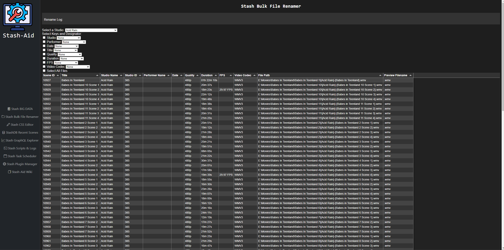

# Stash-Aid 

**As of this time, the add-on assumes you don't have a local API key, and that the address to your Stash is localhost:9999**

A work-in-progress webserver add-on to extend the functionality (and hopefully provide some QoL improvements) of your Stash media server.

## Installation Prerequisites

NodeJS

Python

Ensure you have NodeJS and Python installed on your system. You can download them from the following locations:

NodeJS: https://nodejs.org/

Python: https://www.python.org/downloads/

## Setting up the Environment

Python Dependencies

The Python dependencies are listed in requirements.txt. To install these dependencies, run the following command in your terminal:

```pip install -r requirements.txt```

Node Dependencies

This project requires the following NodeJS packages: axios, puppeteer, and archiver. Install these packages using npm or yarn:

```npm install axios puppeteer archiver```

or

```yarn add axios puppeteer archiver```

## Usage

Running the Flask Server

The main server for stashAid can be launched via terminal from the directory containing 'stashAid.py'

```py stashAid.py```

From here, when you visit the server (server web address is in the terminal) you should be presented with a web page/admin panel with a few options:




Please browse the different pages that are included! 

**NOTE**: In order to get the StashDB page functional, you will need to go into the '/static/script.js' and update 

Line 3: ```const api_key = 'YOUR_STASHDB_API_KEY'; // Replace with your actual API key``` 

**OTHER NOTE**: You may have to change two lines in stashAid.py in order to target your environment's custom.css file for the Stash CSS Editor:

Line 158: ```return send_from_directory('C:\\Stash_Server\\', 'custom.css')```

Line 165: ```with open('C:\\Stash_Server\\custom.css', 'w') as file:```

## More Details

For more details on Python, visit the official documentation: https://docs.python.org/3/

For more details on NodeJS and npm packages, refer to the NodeJS documentation: 

https://nodejs.org/en/docs/ and the npm documentation: https://docs.npmjs.com/
